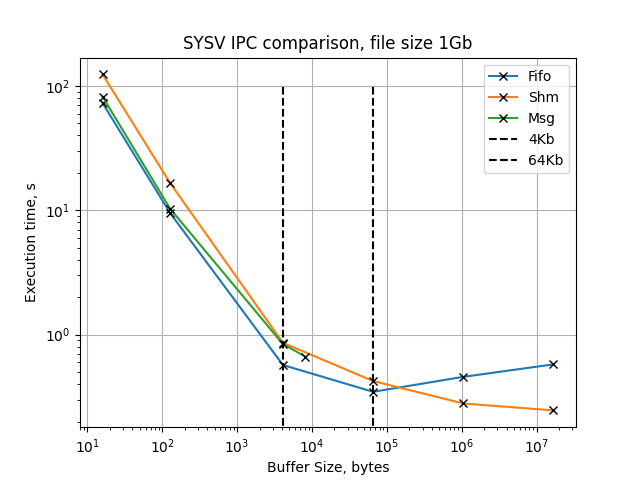

# Task 3: SYSV IPC Comparison
The goal is to compare the performance of different SYSV IPC Primitives: 
- Named pipes (FIFO's)
- Shared memory
- Message queues

# Measurements
The code consists of Tranciever / Receiver implementations (for each IPC primitive) and the benchmarking scripts. The performance was evaluated via measuring the time it takes to completely transmit a 1Gb file. The experiments were performed with different IPC primitives configurations:
- For FIFO, the intermediate buffer size is tweaked
- For Shared Memory, the size of shared memory region is tweaked
- For Message Queue, the size of messages is tweaked (up to its maximum)

The resulting measurements are presented on the figure below:



> Notice: The Shared Memory Tx/Rx implementation involves a mutex and a condition variable for synchronization purposes

# Conclusion

- As it is seen on the figure, the primitives are performing quite similar while the buffer size is less than one page (4 Kb). After that and up to buffer size of 64 Kb, the performance grows less rapidly.

- The Message Queue doesn't support messages larger than 2 pages (8 Kb). 

- The FIFO's performance has dropped after the intermediate buffer size reached 16 pages (64 Kb). Well, this behaviour has a clear reason. The default FIFO's capacity is exactly 64 Kb. Bigger amounts of data doesn't fit in it, so the transmitter starts blocking on ```write()``` calls, and the overall performance drops.

- The Shared Memory data transmission implementation is only limited to the maximum amount of physical RAM it can use. It's execution time tends to zero as the buffer size grows. 

# How to run 
First the benchmark data needs to be generated:
> Warning: GenBenchmarkData.sh generates **1Gb** file

```bash
cd build/3-ipc-comparison
sh GenBenchmarkData.sh
```

Run the benchmarks:

```bash
sh RunBenchmarks.sh > results.txt # will take some time to finish
```

Generate plot:

```bash
python3 Plot.py results.txt
```

The resulting image will be generated as ```Result.png```

# How to test

There are several automated tests which you can run:
> Warning: ```GenTestData.sh``` generates several files with one of them being **4Gb** of size.

```bash
sh GenTestData.sh
python GenTests.py
sh RunTests.sh
```