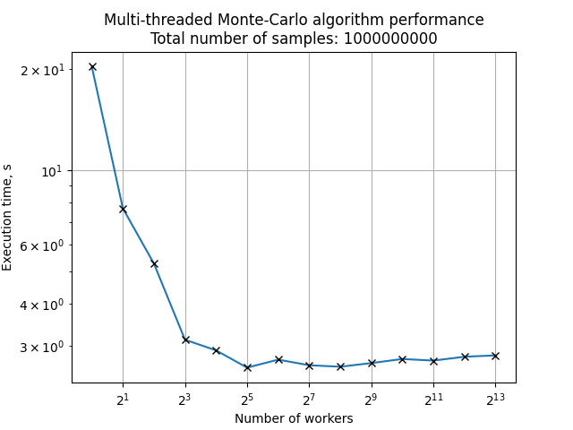

# Task 4: Multi-Threaded integral sum evaluation
The goal is to implement a program that evaluates the integral sum of given function using given number of multiple threads. Then the performance should be measured for different number of threads.

For the integral sum evaluation Monte-Carlo algorithm is used.

# Implementation

The implementation consists of two separated modules:
- The first one involves ThreadPool pattern implementation (see [TnAsync](https://github.com/tndrd/TnAsync) repo)
- The second one uses ThreadPool to calculate integral sum of a given function

# Measurements

The MonteCarlo algorithm makes samples to calculate integral sum. Let overall number of samples be ```N```. Each worker will process ```N/NWorkers``` samples, so overall algorithmical complexity stays the same for any number of workers.

The resulting measurements are presented on the figure below:



> Notice: the host system has 8-core CPU

# Conclusion

- It is seen on figure that performance increases consistently as the number of workers grows.

- When the number of workers reaches the count of CPU cores, performance reaches its maximum.

- Performance stays quite the same for number of workers bigger than CPU core count.

# How to run
```bash
cd build/4-monte-carlo
./RunBenchmark > result.txt
python3 Plot.py result.txt
```

# How to test
```bash
cd build/4-monte-carlo
./ThreadPool/ThreadPool_RunTests
./4-monte-carlo_RunTests
```